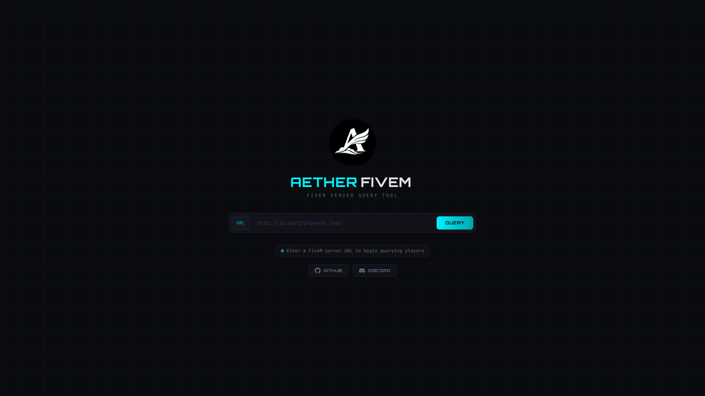
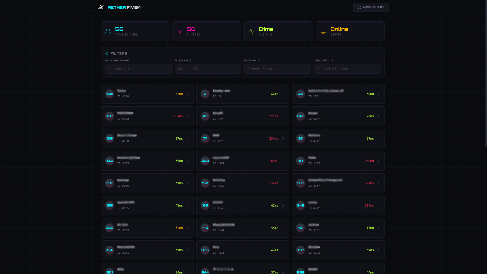
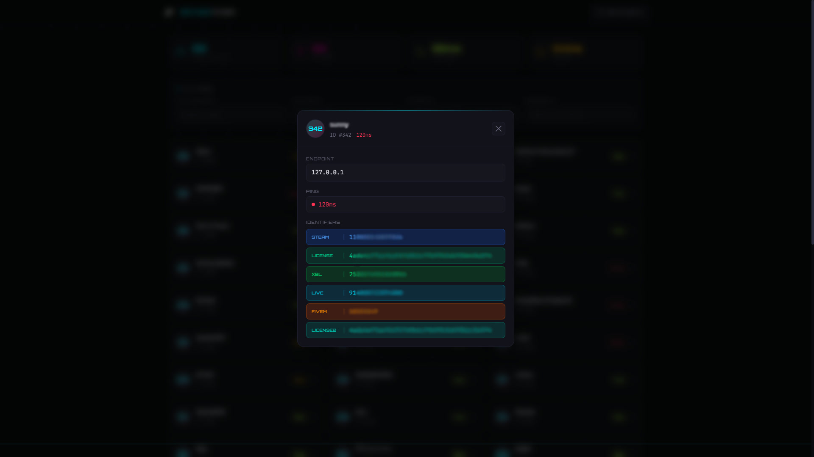

<a href="README.md">
 
</a>
<a href="README-TR.md">
 
</a>

  <br />
  <br />

<div align="center">
  

  <br />
  <br />

  <p>
    FiveM Sunucularında Oyuncu Sorgulama & Analiz Aracı
  </p>


  <p>
    <a href="#features">Özellikler</a> •
    <a href="#technologies">Teknolojiler</a> •
    <a href="#installation">Kurulum</a> •
    <a href="#license">Lisans</a> •
    <a href="#gallery">Galeri</a>
  </p>

  <br />
  <br />
</div>

## 📋 Hakkında

**Aether Fivem**, herhangi bir FiveM oyun sunucusunu sorgulamanıza ve bağlı tüm oyuncuları detaylı bilgileriyle birlikte anında görüntülemenize olanak tanıyan bir web uygulamasıdır.



## ✨ Özellikler <a id="features"></a>

### Sunucu Sorgulama

- Canlı oyuncu verilerini çekmek için herhangi bir FiveM sunucusunun `players.json` uç nokta URL'sini girin.
- Yükleme simgesi, hata yönetimi ve başarı durumu ile anlık geri bildirim.
- Sonuçları temizlemek ve istediğiniz zaman yeni bir başlangıç yapmak için **Yeni Sorgu** butonu.

### Oyuncu Listesi & Detayları

- Tüm çevrimiçi oyuncular duyarlı, animasyonlu bir kart ızgarasında görüntülenir.
- Her kart, renk kodlu gecikme göstergesi ile birlikte **oyuncu adını**, **sunucu ID'sini** ve **ping** değerini gösterir.
- **detaylı bir modal** açmak için herhangi bir oyuncuya tıklayın:

### Gelişmiş Filtreleme

Belirli oyuncuları hızlıca bulmak için gerçek zamanlı, çok kriterli arama:

- **Oyuncu Adı**: Oyun içi isme göre filtrele.
- **Oyuncu ID'si**: Sunucu tarafından atanan ID'ye göre filtrele.
- **Steam ID**: Steam hex tanımlayıcısına göre filtrele.
- **Discord ID**: Discord tanımlayıcısına göre filtrele.
- Kesin sonuçlar için tüm filtreler eş zamanlı çalışır.
- Tüm filtreleri anında sıfırlamak için **Hepsini Temizle** butonu.

### Canlı İstatistikler

Bir bakışta aşağıdakileri gösteren pano istatistik kartları:

- **Toplam Oyuncu**: Bağlı oyuncu sayısı.
- **Filtrelenen**: Mevcut filtre kriterlerine kaç oyuncunun uyduğu.
- **Ortalama Ping**: Tüm bağlı oyuncuların ortalama gecikmesi.
- **Sunucu**: Çevrimiçi durum göstergesi.

## 🛠️ Teknolojiler <a id="technologies"></a>

- **Frontend:** `React 19`, `Vite`, `Tailwind CSS`, `Axios`
- **Backend:** `Node.js`, `Express.js`, `CORS`

## 🚀 Kurulum <a id="installation"></a>

Projeyi yerel ortamınızda çalıştırmak için aşağıdaki adımları izleyin.

### Gereksinimler

- **Node.js** (v18+)
- **npm**

### Adım Adım Kurulum

1.  **Depoyu Klonlayın**

    ```bash
    git clone https://github.com/xkintaro/aether-fivem.git
    cd aether-fivem
    ```

2.  **Backend Bağımlılıklarını Yükleyin**

    ```bash
    cd backend
    npm install
    ```

3.  **Frontend Bağımlılıklarını Yükleyin**

    ```bash
    cd ../frontend
    npm install
    ```

4.  **Backend Sunucusunu Başlatın**

    ```bash
    cd ../backend
    node index.js
    ```

    Backend `http://localhost:5000` adresinde çalışacaktır.

5.  **Frontend Sunucusunu Başlatın**
    Yeni bir terminal açın:
    ```bash
    cd frontend
    npm run dev
    ```
    Frontend `http://localhost:5173` adresinde çalışacaktır.

### Kullanım

1. Tarayıcınızda `http://localhost:5173` adresini açın.
2. Bir FiveM sunucusunun oyuncu uç nokta URL'sini girin (örn. `http://ip:port/players.json`).
3. Tüm bağlı oyuncuları çekmek ve görüntülemek için **Sorgula**'ya tıklayın.
4. İsim, ID, Steam veya Discord ile arama yapmak için filtre girişlerini kullanın.
5. Detaylı bilgilerini görüntülemek için herhangi bir oyuncu kartına tıklayın.

## 📄 Lisans <a id="license"></a>

Bu proje MIT Lisansı altında lisanslanmıştır. Ayrıntılar için [LICENSE](LICENSE) dosyasını inceleyebilirsiniz.

## 🖼️ Galeri <a id="gallery"></a>



#



#

<p align="center">
  <sub>❤️ Developed by "Mustafa TAŞAL" (kintaro)</sub>
</p>
