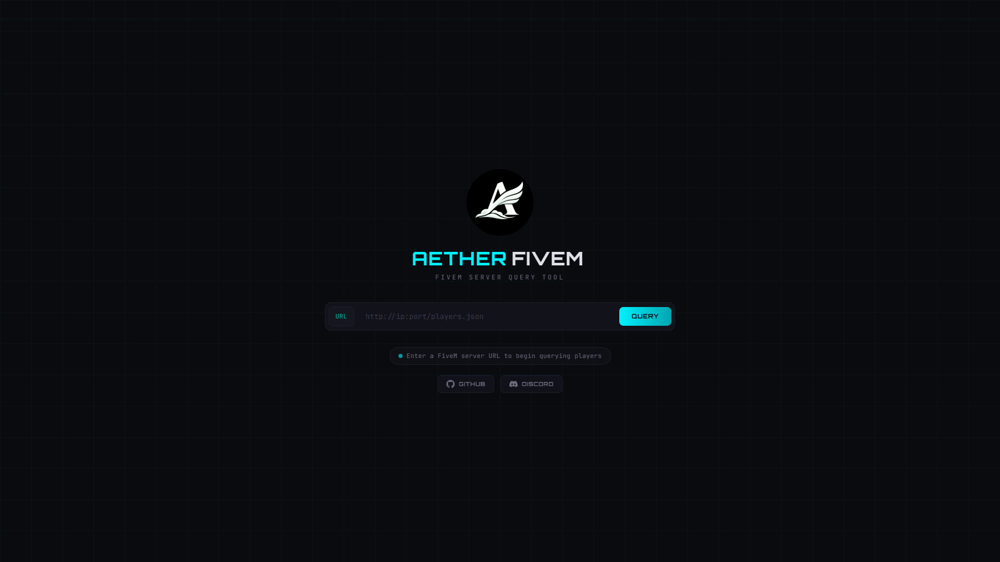
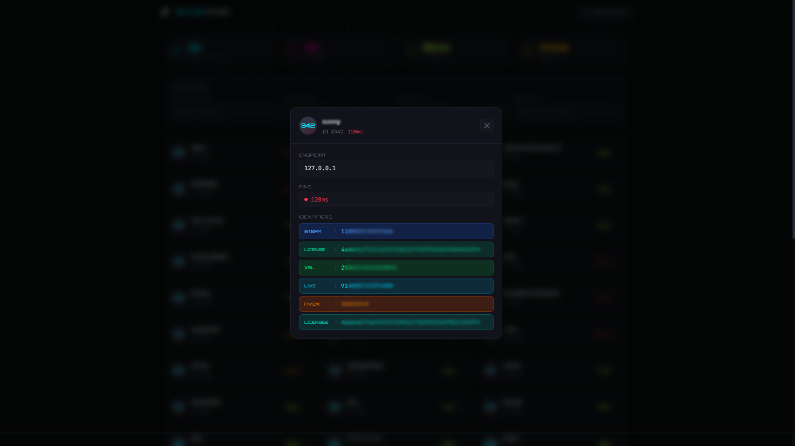

<div align="center">
  
  <br />
  <br />

  [](https://react.dev/)
  [](https://vitejs.dev/)
  [](https://tailwindcss.com/)
  [](https://nodejs.org/)
  [](https://expressjs.com/)
  [](https://developer.mozilla.org/en-US/docs/Web/JavaScript)

  <p align="center">
    <b>FiveM Server Player Query & Analysis Tool</b>
    <br />
    <br />
    <a href="#features">Features</a> •
    <a href="#technologies">Technologies</a> •
    <a href="#setup">Setup</a> 
  </p>
</div>

---

## 📋 About

**Aether Fivem** is a modern web application that allows you to query any FiveM game server and instantly view all connected players along with their detailed information.

Just enter a FiveM server's `players.json` endpoint URL, and the tool will fetch and display all online players with their **name**, **ID**, **ping**, **endpoint**, and full **identifiers** (Steam, Discord, License, FiveM, Xbox Live, IP, etc.).



## <a id="features"></a> ✨ Features

### 🔍 Server Query
- Enter any FiveM server's `players.json` endpoint URL to fetch live player data.
- Instant feedback with loading spinner, error handling, and success state.
- **New Query** button to clear results and start fresh at any time.

### 👥 Player List & Details
- All online players are displayed in a responsive, animated card grid.
- Each card shows **player name**, **server ID**, and **ping** with color-coded latency indicator.
- Click on any player to open a **detailed modal** showing:
  - Endpoint (IP:Port)
  - Ping with visual indicator
  - Full list of identifiers with color-coded badges (Steam, Discord, License, License2, XBL, Live, FiveM, IP)

### 🔎 Advanced Filtering
Real-time, multi-criteria search to quickly find specific players:
- **Player Name**: Filter by in-game name.
- **Player ID**: Filter by server-assigned ID.
- **Steam ID**: Filter by Steam hex identifier.
- **Discord ID**: Filter by Discord identifier.
- All filters work simultaneously for precise results.
- **Clear All** button to reset all filters instantly.

### 📊 Live Statistics
Dashboard stat cards showing at a glance:
- **Total Players**: Number of connected players.
- **Filtered**: How many players match current filter criteria.
- **Avg Ping**: Average latency of all connected players.
- **Server**: Online status indicator.


## <a id="technologies"></a> 🛠️ Technologies

### Frontend
- **[React 19](https://react.dev/)**
- **[Vite 7](https://vitejs.dev/)**
- **[Tailwind CSS v4](https://tailwindcss.com/)**
- **[Axios](https://axios-http.com/)**

### Backend
- **[Node.js](https://nodejs.org/)**
- **[Express 5](https://expressjs.com/)**
- **[CORS](https://www.npmjs.com/package/cors)**



## <a id="setup"></a> 🚀 Setup and Development

Follow the steps below to run the project in your local environment.

### Requirements
- **Node.js** (v18+)
- **npm**

### Step-by-Step Installation

1.  **Clone the Repo**
    ```bash
    git clone https://github.com/xkintaro/aether-fivem.git
    cd aether-fivem
    ```

2.  **Install Backend Dependencies**
    ```bash
    cd backend
    npm install
    ```

3.  **Install Frontend Dependencies**
    ```bash
    cd ../frontend
    npm install
    ```

4.  **Start the Backend Server**
    ```bash
    cd ../backend
    node index.js
    ```
    Backend will be running at `http://localhost:5000`

5.  **Start the Frontend Dev Server**
    Open a new terminal:
    ```bash
    cd frontend
    npm run dev
    ```
    Frontend will be running at `http://localhost:5173`

### Usage

1. Open `http://localhost:5173` in your browser.
2. Enter a FiveM server's player endpoint URL (e.g. `http://ip:port/players.json`).
3. Click **Query** to fetch and display all connected players.
4. Use the filter inputs to search by name, ID, Steam, or Discord.
5. Click on any player card to view their detailed information.

---

<p align="center">
  <sub>❤️ Developed by Kintaro.</sub>
</p>